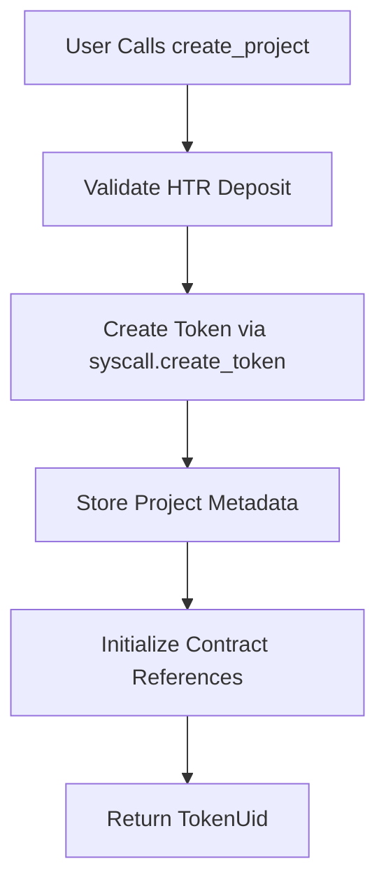

# DozerTools Contract Architecture

## Overview

The DozerTools contract (`dozer_tools.py`) is a **singleton factory contract** that serves as the central management hub for token projects in the Hathor Network ecosystem. It implements a credit-based fee system and manages the entire lifecycle of token projects from creation to ecosystem deployment.

## Core Concept: Factory Pattern

DozerTools acts as a **factory contract** that:
- Creates and manages multiple token projects
- Deploys associated contracts (vesting, staking, DAO, crowdsale)
- Manages liquidity pools through DozerPoolManager integration
- Provides a unified interface for project management

## Architecture Components

### 1. Singleton Design

```python
class DozerTools(Blueprint):
    """Singleton contract for managing token projects with credit-based fee system."""
```

**Key Characteristics**:
- Single contract instance manages all projects
- Global administration through owner address
- Centralized fee collection and management
- Unified project registry

### 2. Project Identification System

**Primary Key**: `TokenUid` (Token Universal Identifier)
- One project per token (1:1 relationship)
- TokenUid serves as unique project identifier
- Deterministic token creation ensures consistency

```python
# Project registry using TokenUid as key
project_exists: dict[TokenUid, bool]
project_name: dict[TokenUid, str]
project_dev: dict[TokenUid, Address]
```

### 3. Credit-Based Fee System

**Dual Token Economy**:
- **HTR** (Hathor native token): Higher cost operations
- **DZR** (Dozer token): Preferred, cheaper operations

**Fee Preference Logic**:
```python
def _charge_fee(self, ctx: Context, token_uid: TokenUid, method_name: str):
    # Try DZR first (cheaper), fall back to HTR
    if dzr_fee > 0 and project_dzr_balance >= dzr_fee:
        # Use DZR
    elif htr_fee > 0 and project_htr_balance >= htr_fee:
        # Use HTR
```

## State Management Architecture

### 1. Project Data Separation

**Basic Information** (always present):
```python
project_name: dict[TokenUid, str]
project_symbol: dict[TokenUid, str]
project_dev: dict[TokenUid, Address]
project_created_at: dict[TokenUid, Timestamp]
project_total_supply: dict[TokenUid, Amount]
```

**Optional Metadata** (only stored if provided):
```python
project_description: dict[TokenUid, str]
project_website: dict[TokenUid, str]
project_logo_url: dict[TokenUid, str]
# ... other optional fields
```

### 2. Contract Ecosystem Tracking

**Associated Contracts per Project**:
```python
project_vesting_contract: dict[TokenUid, ContractId]
project_staking_contract: dict[TokenUid, ContractId]
project_dao_contract: dict[TokenUid, ContractId]
project_crowdsale_contract: dict[TokenUid, ContractId]
project_pools: dict[TokenUid, str]  # Pool keys from DozerPoolManager
```

### 3. Credit Balance Management

**Per-Project Credit Balances**:
```python
project_htr_balance: dict[TokenUid, Amount]
project_dzr_balance: dict[TokenUid, Amount]
```

## Contract Interaction Patterns

### 1. Token Creation Flow



**HTR Deposit Requirement**:
- Users must deposit exactly 1% of total supply in HTR
- Prevents users from consuming each other's HTR
- Ensures fair cost distribution

```python
required_htr = total_supply // 100  # 1% of total supply
if htr_action.amount != required_htr:
    raise InsufficientCredits("HTR deposit amount must equal 1% of total supply")
```

### 2. Contract Creation Pattern

**Deterministic Contract Addresses**:
```python
def _generate_salt(self, ctx: Context, token_uid: TokenUid, contract_type: str) -> bytes:
    return (
        token_uid
        + bytes(contract_type, "utf-8")
        + bytes(str(ctx.timestamp), "utf-8")
    )
```

**Contract Creation Flow**:
1. Generate unique salt for deterministic addresses
2. Prepare initial token deposits for new contract
3. Call `syscall.create_contract` with blueprint ID
4. Store contract reference in project data
5. Transfer authorities if needed

### 3. DozerPoolManager Integration

**Liquidity Pool Creation**:
```python
def create_liquidity_pool(self, ctx: Context, token_uid: TokenUid, ...):
    # Prepare tokens for pool
    actions = [
        NCDepositAction(token_uid=token_uid, amount=token_amount),
        NCDepositAction(token_uid=TokenUid(HTR_UID), amount=htr_amount),
    ]
    
    # Call DozerPoolManager to create pool
    pool_key = self.syscall.call_public_method(
        self.dozer_pool_manager_id, "create_pool", actions, fee
    )
```

## Access Control Architecture

### 1. Multi-Level Authorization

**Owner Level** (Global Admin):
- Update method fees
- Blacklist/unblacklist tokens
- Set legacy token permissions
- Change contract ownership

**Project Developer Level** (Per-Project):
- Manage project contracts
- Deposit credits
- Create ecosystem contracts
- Get melt authority

**User Level** (Public):
- View project information
- Search projects by category
- Check token blacklist status

### 2. Legacy Token Support

**Admin-Controlled Permissions**:
```python
legacy_token_permissions: dict[TokenUid, Address]

def _validate_legacy_token_permission(self, ctx: Context, token_uid: TokenUid):
    if token_uid in self.legacy_token_permissions:
        authorized_address = self.legacy_token_permissions[token_uid]
        if Address(ctx.address) != authorized_address:
            raise Unauthorized("Not authorized for this legacy token")
```

## View Method Architecture

### 1. JSON-Structured Responses

All view methods return `dict[str, str]` for frontend compatibility:

```python
@view
def get_project_info(self, token_uid: TokenUid) -> dict[str, str]:
    return {
        "token_uid": token_uid.hex(),
        "name": self.project_name.get(token_uid, ""),
        "dev": self.project_dev.get(token_uid, Address(b"\x00" * 25)).hex(),
        # ... all fields as strings
    }
```

### 2. Search and Filter Methods

**Category-Based Search**:
```python
@view
def search_projects_by_category(self, category: str) -> dict[str, str]:
    projects = {}
    for token_uid in self.all_projects:
        if not self.blacklisted_tokens.get(token_uid, False):
            if self.project_category.get(token_uid, "") == category:
                projects[token_uid.hex()] = self.project_name.get(token_uid, "")
    return projects
```

## Error Handling Strategy

### 1. Custom Exception Hierarchy

```python
class DozerToolsError(NCFail):
    """Base error for DozerTools operations."""

class ProjectNotFound(DozerToolsError):
    """Raised when trying to access a project that doesn't exist."""

class InsufficientCredits(DozerToolsError):
    """Raised when project has insufficient credits for operation."""
```

### 2. Validation Patterns

**Multi-Step Validation**:
1. Check project existence
2. Validate user permissions  
3. Check credit balances
4. Validate input parameters
5. Execute operation

## Testing Architecture

### 1. Helper Method Pattern

```python
def _create_test_project(
    self,
    name: str = "TestToken",
    symbol: str = "TEST", 
    category: str = "DeFi",
    dev_address: Optional[Address] = None,
) -> TokenUid:
    # Standardized project creation for tests
    total_supply = Amount(10000000)
    required_htr = total_supply // 100
    # ... create project with proper HTR deposit
```

### 2. Multi-User Test Patterns

**Isolation Testing**:
- Each user provides their own HTR deposit
- Verify no cross-user HTR consumption
- Test different project parameters per user
- Validate proper ownership separation

## Integration Points

### 1. External Contract Dependencies

**DozerPoolManager**:
- Creates liquidity pools for projects
- Manages pool keys and metadata
- Handles LP token distributions

**Blueprint Contracts**:
- Vesting: Token distribution schedules
- Staking: Reward mechanisms
- DAO: Governance structures  
- Crowdsale: Token sales

### 2. Token Authority Management

**Mint/Melt Authorities**:
- Contract initially holds both authorities
- Can transfer melt authority to project owner
- Vesting contract typically receives mint authority

## Performance Considerations

### 1. State Access Patterns

**Avoid Expensive Operations**:
- No dictionary iteration
- Manual counters instead of `len()`
- Direct key access only
- Minimal nested data structures

### 2. Gas Optimization

**Batch Operations**:
- Combine multiple state updates
- Minimize external contract calls
- Use efficient data structures

## Security Considerations

### 1. Reentrancy Protection

**Single Action Validation**:
```python
if len(ctx.actions) != 1:
    raise InsufficientCredits("Exactly one deposit action allowed")
```

### 2. Input Validation

**Comprehensive Checks**:
- Token UID validation
- Amount range validation
- Address format validation
- String length limits

## Future Extensibility

### 1. Multi-Pool Support

```python
# TODO: Change to support multiple pools
project_pools: dict[TokenUid, str]  # Currently single pool
# Future: project_pools: dict[TokenUid, list[str]]
```

### 2. Additional Contract Types

The architecture supports easy addition of new contract types:
1. Add new blueprint ID constant
2. Add new contract reference storage
3. Implement creation method
4. Update view methods

## Deployment Considerations

### 1. Blueprint Dependencies

Required blueprint IDs must be deployed first:
- Vesting Blueprint
- Staking Blueprint  
- DAO Blueprint
- Crowdsale Blueprint
- DozerPoolManager

### 2. Initialization Parameters

```python
def initialize(
    self,
    ctx: Context,
    dozer_pool_manager_id: ContractId,
    dzr_token_uid: TokenUid,
    minimum_deposit: Amount,
):
```

**Critical Setup**:
- DozerPoolManager must be deployed and initialized
- DZR token must exist and be accessible
- Minimum deposit amount should be carefully chosen

This architecture provides a robust, extensible foundation for managing complex token project ecosystems while maintaining simplicity and efficiency. 